# 🛍️ AI Shop — Conversational AI Search for eCommerce

A React Native (Expo) mobile eCommerce app that lets users search for products using **natural language**, powered by an AI-driven intent parser. Ask for *"running shoes under ₹10,000"* or *"dress above ₹500"* and the app understands category, budget, and feature intent — no filters required.

Built with **Expo Router**, **TypeScript**, and a pluggable AI search layer that works out-of-the-box with a local rule-based NLP engine, and upgrades automatically to **Google Gemini** or **OpenAI** when an API key is provided.

---
## 🔗 Live Demo

**[View the live app →](https://6a657d58f9e9fa84a4452f28--inquisitive-zuccutto-3a35be.netlify.app/)**

---

## ✨ Features

- 🗣️ **Natural language product search** — type or speak a query like *"lightweight running shoes under ₹5,000"*
- 🤖 **AI intent parsing** — extracts category, budget (min/max), and feature keywords from free text
- 🔍 **Graceful AI fallback** — uses Gemini if configured, otherwise falls back to a local mock NLP engine automatically
- 🏷️ **"Why this matched" explanations** — every result shows a badge explaining why it was recommended
- 🛒 **Cart & checkout flow** — add to cart, buy now, view order confirmation
- 💰 **Single currency (INR)** — consistent ₹ pricing across the entire app
- 🏷️ **Category filter chips** — Running, Audio, Water Bottles, Backpacks, Dresses
- 📦 **117+ product catalog** across 5 categories, with sale pricing, stock status, and review counts
- 📱 **Responsive product grid** — 2-column layout with sale badges and out-of-stock overlays
- 🎙️ **Voice search** (web only — see [Platform Notes](#-platform-notes))

---

## 📸 Screenshots

| | |
|---|---|
| 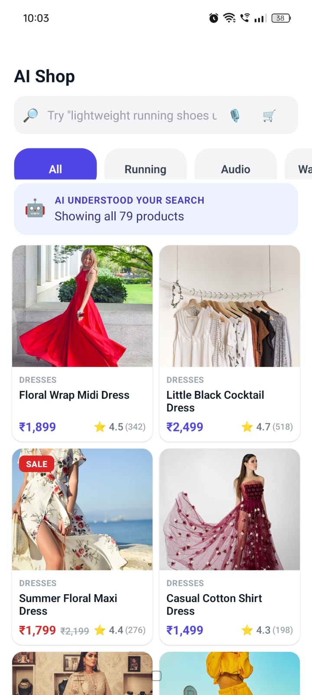 All products view | 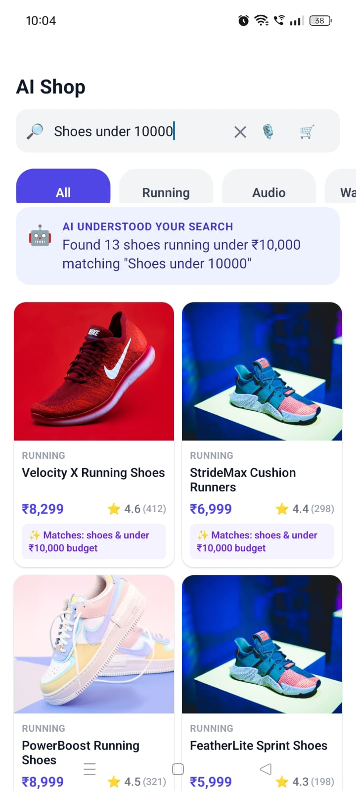 Budget-based search |
| 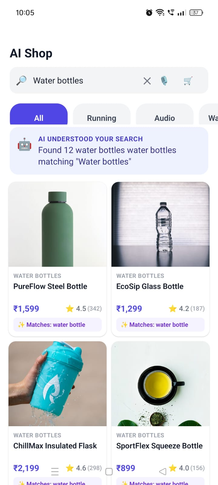 Category search | 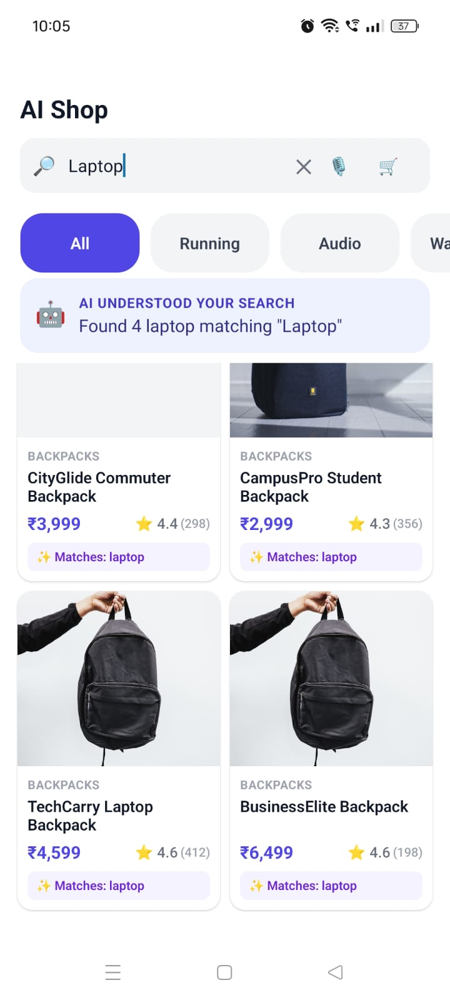 Keyword search |
| 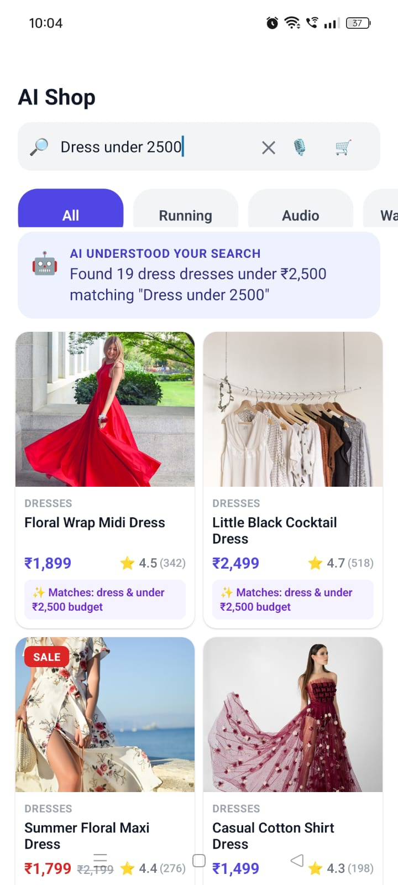 Natural language budget query |  "Above" budget query |
| 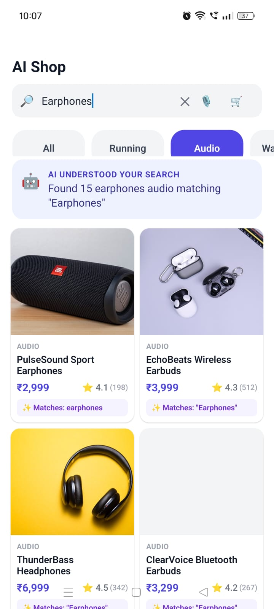 Feature matching | 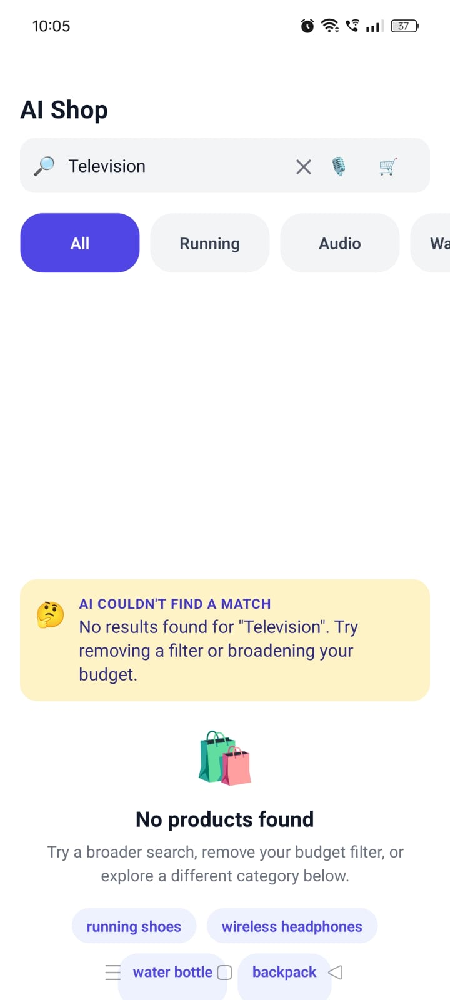 Empty state with suggestions |
| 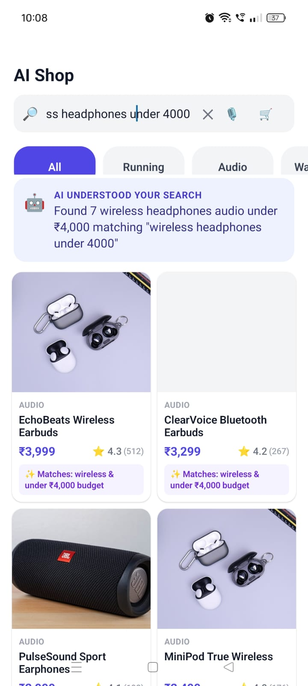 Multi-word budget query |  Product detail page |
| 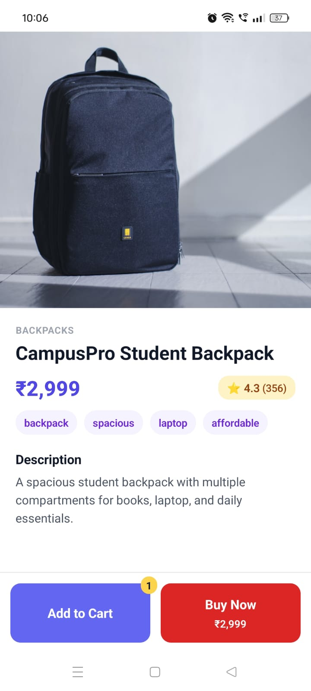 Cart badge update | 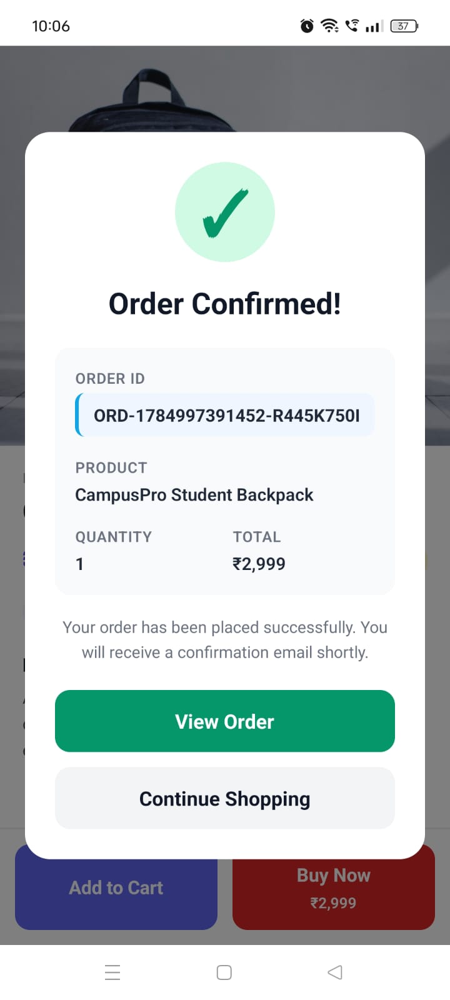 Order confirmation modal |
| 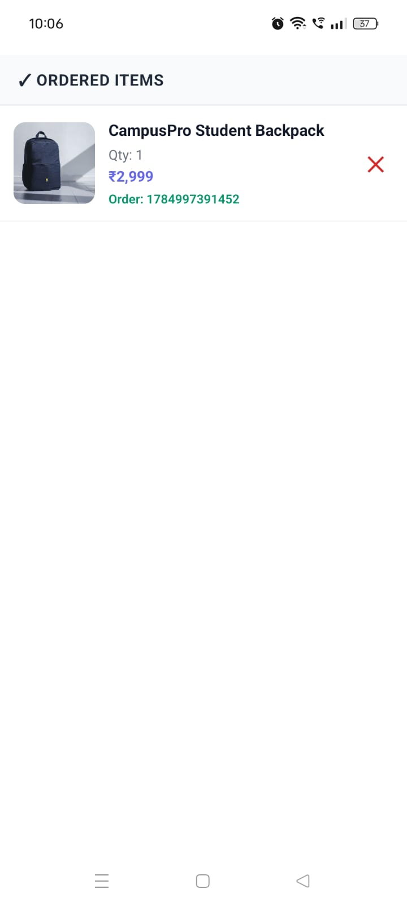 Order history in cart | | |

> 📁 Save your screenshots into a `screenshots/` folder at the project root using the filenames above (or update the paths in this table to match your own).

---

## 🧠 How AI Search Works

```
User Query ("running shoes under ₹5,000")
        │
        ▼
┌───────────────────────────┐
│   searchProductsWithAI()  │
└───────────────────────────┘
        │
        ▼
   API key present? ──── Yes ──▶  Gemini / OpenAI intent parser
        │ No                              │
        ▼                                 ▼
  Local Mock NLP Engine  ◀── (on API failure, falls back here)
        │
        ▼
  { category, minPrice, maxPrice, keywords }
        │
        ▼
   Score & filter product catalog
        │
        ▼
  Ranked results + "why it matched" explanation
```

The mock NLP engine recognizes:
- **Budget phrases**: `under`, `over`, `below`, `above`, `between X and Y` — with or without `₹`, commas, or the word "rs"
- **Category keywords**: e.g. "shoes", "sneakers" → Running; "bottle", "flask" → Water Bottles
- **Feature keywords**: lightweight, waterproof, wireless, insulated, and 25+ others matched against product tags

---

## 🏗️ Tech Stack

| Layer | Technology |
|---|---|
| Framework | [Expo](https://expo.dev/) SDK 54 (React Native 0.81) |
| Routing | [Expo Router](https://docs.expo.dev/router/introduction/) (file-based) |
| Language | TypeScript |
| AI Providers | Google Gemini 1.5 Flash *(optional)*, OpenAI GPT-4o-mini *(optional)*, local fallback |
| State | React hooks + Context API (`CartContext`) |
| Voice Input | Web Speech API *(web only)* |

---

## 📂 Project Structure

```
ecommerce-ai-search/
├── app.json
├── package.json
├── src/
│   ├── app/                       # Expo Router screens (file-based routing)
│   │   ├── _layout.tsx            # Root layout + CartProvider
│   │   ├── index.tsx              # Home / AI Search screen
│   │   ├── cart.tsx                # Cart screen
│   │   ├── profile.tsx             # Profile screen
│   │   └── product/
│   │       └── [id].tsx            # Product detail screen
│   ├── components/                # Reusable UI components
│   │   ├── Header.tsx              # Search bar + voice + cart icon
│   │   ├── FilterChips.tsx         # Category filter pills
│   │   ├── ProductCard.tsx         # Grid product card
│   │   ├── ProductActionBar.tsx    # Add to Cart / Buy Now bar
│   │   ├── PurchaseModal.tsx       # Order confirmation modal
│   │   └── SummaryBanner.tsx       # AI explanation banner
│   ├── context/
│   │   └── CartContext.tsx         # Cart + purchase state
│   ├── data/
│   │   └── product.ts              # Product catalog (117+ items)
│   ├── services/
│   │   └── aiSearch.ts             # AI intent parsing + scoring logic
│   ├── utils/
│   │   └── currency.ts             # INR price formatting
│   └── types/
│       └── product.ts              # Shared TypeScript interfaces
```

---

## 🚀 Getting Started

### Prerequisites

- [Node.js](https://nodejs.org/) 18 or later
- npm (comes with Node.js)
- [Expo Go](https://expo.dev/go) app installed on your Android/iOS device *(for mobile testing)*

### 1. Clone the repository

```bash
git clone https://github.com/YOUR_USERNAME/ecommerce-ai-search.git
cd ecommerce-ai-search
```

### 2. Install dependencies

```bash
npm install
```

### 3. (Optional) Configure AI provider keys

Create a `.env` file in the project root to enable real AI-powered search instead of the local mock engine:

```env
EXPO_PUBLIC_GEMINI_API_KEY=your-gemini-api-key
EXPO_PUBLIC_OPENAI_API_KEY=your-openai-api-key
```

> The app works fully without either key — it automatically uses a local rule-based NLP engine as a fallback.

### 4. Start the development server

```bash
npx expo start
```

Then:
- **On your phone:** open the **Expo Go** app and scan the QR code shown in the terminal
- **On web:** press `w` in the terminal, or run `npm run web`
- **On Android emulator:** press `a`
- **On iOS simulator:** press `i` *(macOS only)*

---

## 🧪 Useful Commands

| Command | Description |
|---|---|
| `npx expo start` | Start Metro bundler (default LAN mode) |
| `npx expo start --tunnel` | Start with tunnel mode (for restrictive networks) |
| `npx expo start -c` | Start with a cleared Metro cache |
| `npm run android` | Start and open on Android |
| `npm run ios` | Start and open on iOS *(macOS only)* |
| `npm run web` | Start and open in the browser |
| `npx expo export -p web` | Build a static web bundle into `dist/` |

---

## 🌐 Deployment (Web Demo)

This project can be exported as a static web app and hosted anywhere.

### 1. Build the static export

```bash
npx expo export -p web
```

This generates a deployable static site inside the `dist/` folder.

### 2. Deploy — pick one

**Option A: Netlify Drop** *(fastest, no CLI)*
1. Go to [app.netlify.com/drop](https://app.netlify.com/drop)
2. Drag and drop the `dist/` folder
3. Get an instant live URL

**Option B: Vercel CLI**
```bash
npm install -g vercel
cd dist
vercel --prod
```

**Option C: GitHub Pages**
```bash
git init
git add .
git commit -m "deploy"
git branch -M gh-pages
git remote add origin https://github.com/YOUR_USERNAME/YOUR_REPO.git
git subtree push --prefix dist origin gh-pages
```
Then enable **Settings → Pages → Source: `gh-pages` branch** in your GitHub repo.

---

## 📱 Platform Notes

- **Voice search** uses the Web Speech API and is only available when running in a browser (`npm run web`). It is intentionally disabled on native Expo Go builds, since native speech recognition requires a custom dev client and is not supported inside Expo Go.
- **Currency** is fixed to Indian Rupees (₹) throughout the app — there is no currency toggle.
- **Images** are loaded from Unsplash over HTTPS; if a network request fails, the app displays a graceful placeholder instead of a broken image.

---

## 🗺️ Example Queries to Try

```
running shoes under 10000
wireless headphones under 4000
dress above 500
dress under 2500
water bottles
laptop backpack
earphones
lightweight running shoes under ₹5,000
```

---

## 🔮 Future Improvements

- [ ] Persist cart state across app restarts
- [ ] Add user authentication and order history sync
- [ ] Server-side product catalog (replace static mock data)
- [ ] Native voice search via a custom Expo dev client
- [ ] Wishlist / saved items

---

## 📄 License

This project is provided as-is for educational and demonstration purposes.

---
## 🙋 Author

**Nireeksha P**  
Built as part of a conversational AI eCommerce search project submission.
- 💻 GitHub: [@Nireeksha-Naik](https://github.com/Nireeksha-Naik)
